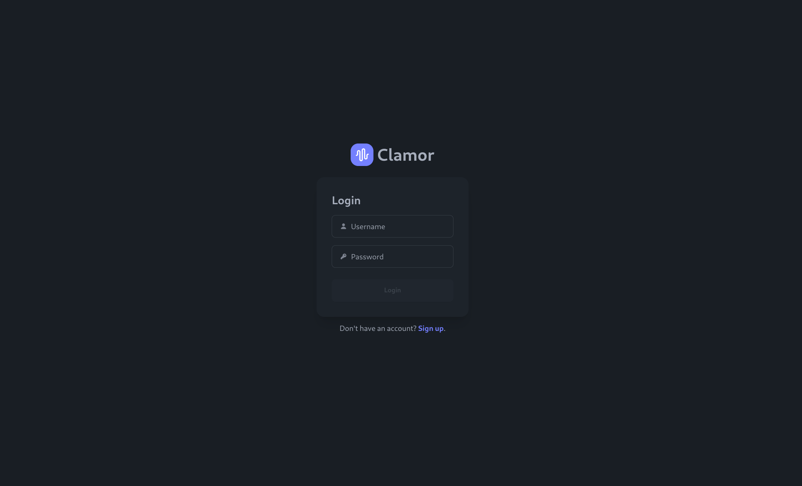
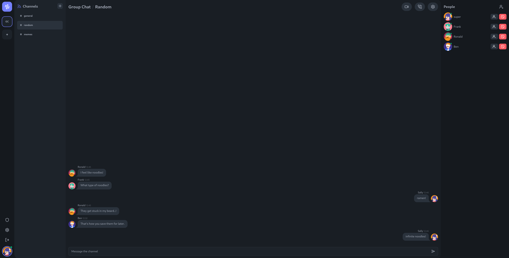
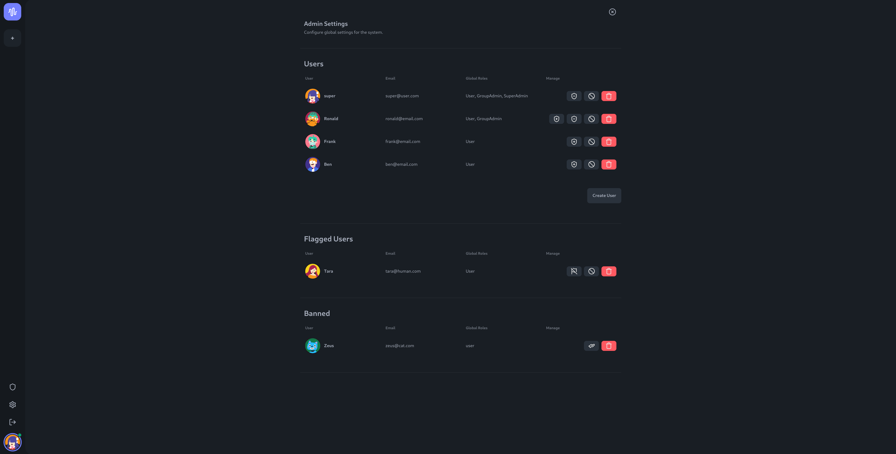

<!-- PROJECT LOGO -->
<br />
<div align="center">
  <a href="https://github.com/maze7/3813ict">
    
  </a>
<h3 align="center">Clamor - Community & Chat Application</h3>
</div>

<!-- ABOUT THE PROJECT -->
## About The Project

This is the source code repository for the Clamor project. Clamor is a voice, video and text communication platform where users can sign up for free and join a number of groups. Within each group, users can make new friends by participating in channel conversations, calls and video hang-outs.

The project is broken into two parts; `frontend/` and `backend/`. Each project has an individual npm project and dependencies. The frontend is an Angular 18 SPA, with the backend being a ExpressJS webserver.

Git has been used during the development of this project for version control & data backups. As this project has a solo developer, a strict branching strategy such as feature branching is not required. The branching strategy on the project is to create a new branch when a major change is required that might not be merged to `main`.

## Project Structure

### Frontend
```
3813ict/
├── docs/
├── frontend/
│   ├── .angular/
│   ├── .vscode/
│   ├── node_modules/           # Library root for dependencies
│   ├── public/                 # Public assets and files
│   ├── src/                    # Source code for the frontend
│   ├── .editorconfig           # Editor configuration
│   ├── .gitignore              # Git ignore file
│   ├── angular.json            # Angular project configuration
│   ├── package.json            # NPM package configuration
│   ├── package-lock.json       # NPM lock file
│   ├── README.md               # Frontend-specific README
│   ├── tailwind.config.js      # Tailwind CSS configuration
│   ├── tsconfig.app.json       # TypeScript configuration for the app
│   ├── tsconfig.json           # Global TypeScript configuration
│   └── tsconfig.spec.json      # TypeScript configuration for tests
```

### Server
```
├── server/
│   ├── data/                   # Static data for the backend
│   │   ├── groups.json         # JSON data for groups
│   │   └── users.json          # JSON data for users
│   ├── node_modules/           # Library root for dependencies
│   ├── src/                    # Source code for the backend
│   │   ├── middleware/         # Middleware logic
│   │   ├── models/             # Database models
│   │   ├── routes/             # API routes
│   │   └── util/               # Utility functions
│   ├── .env                    # Environment configuration file
│   ├── .gitignore              # Git ignore file
│   ├── package.json            # NPM package configuration
│   ├── package-lock.json       # NPM lock file
│   └── server.js               # Entry point for the backend server
```

## External Libraries

- Frontend: Uses Angular, Tailwind CSS
- Backend: Node.js, Express, MongoDB

### How to Run

#### Frontend
1. Navigate to the `frontend` folder:
   ```bash
   cd frontend
   ```
2. Install dependencies:
   ```bash
   npm install
   ```
3. Start the Angular development server:
   ```bash
   ng serve
   ```

#### Backend
1. Navigate to the `server` folder:
   ```bash
   cd server
   ```
2. Install dependencies:
   ```bash
   npm install
   ```
3. Start the backend server:
   ```bash
   node server.js
   ```

## Angular Project Architecture

### 1. **Components**
The `components` directory contains reusable UI elements and specific application sections that define the interface and behavior of the application.

- **add-user-modal**: Component for the modal interface to add a new user.
- **channel-nav**: Navigation component for switching between different channels.
- **chat**: Component handling the chat functionality, including messages and interactions.
- **create-user**: Component for creating a new user.
- **group-settings**: Component to configure group settings, including managing members and admins.
- **nav**: Component for the main navigation of the application.
- **new-channel-modal**: Modal component for creating new channels within a group.
- **new-group-modal**: Modal component for creating new groups.
- **people**: Component to manage or display the people/users involved in the current session or chat.

### 2. **Guards**
Guards are used to control navigation and access based on authentication or roles.

- **admin.guard.ts**: Guard that restricts access to specific routes for users with an admin role.
- **auth.guard.ts**: Guard that checks if the user is authenticated before granting access to certain routes.

### 3. **Interceptors**
Interceptors are used to modify or monitor HTTP requests and responses.

- **auth.interceptor.ts**: Intercepts HTTP requests to attach authentication tokens (e.g., JWT) for secured communication with the backend API.

### 4. **Models**
Models define the data structures used throughout the application.

- **auth.model.ts**: Represents authentication-related data, such as user information and tokens.
- **channel.model.ts**: Represents a channel, including properties like ID, name, and members.
- **group.model.ts**: Represents a group entity, including properties like name, acronym, owner, members, and channels.
- **user.model.ts**: Represents a user entity with properties like username, email, roles, and status (banned or flagged).

### 5. **Pages**
The `pages` directory contains components responsible for specific views or routes of the application.

- **admin**: Page for managing users and groups with administrative privileges.
- **chat**: Page for viewing and interacting in chat channels.
- **dashboard**: The main dashboard page of the application.
- **group**: Page for displaying group-specific information and managing group settings.
- **login**: Page for user authentication (login form).
- **profile**: Page for viewing and editing user profile details.
- **register**: Page for user registration.

### 6. **Services**
Services handle the business logic and communication with the backend API.

- **auth.service.ts**: Handles authentication-related operations such as login, logout, token management, and user registration.
- **group.service.ts**: Manages group-related operations like creating groups, fetching groups, and updating group data.
- **user.service.ts**: Handles user-related operations such as fetching user data, updating user information, and managing user roles.

### 7. **Routes**
The `app.routes.ts` file defines the routing structure of the application, mapping URL paths to specific components or pages, such as login, chat, and group views.

---

## Data Models (Used by both Frontend & Backend)

### 1. **User Interface**
The `User` interface represents an individual user within the system.

- **Fields**:
   - `_id?` (optional `string`): Unique identifier for the user, typically from the database.
   - `username` (`string`): The user's username, used for identification in the application.
   - `email` (`string`): The user's email address.
   - `id` (`string`): Another identifier for the user, possibly for frontend purposes.
   - `avatar?` (optional `string`): URL to the user's avatar image.
   - `roles` (`string[]`): An array of roles assigned to the user (e.g., `["admin", "member"]`).
   - `banned` (`boolean`): Indicates whether the user is banned from certain actions.
   - `flagged` (`boolean`): Indicates whether the user has been flagged for attention by administrators.

### 2. **Group Interface**
The `Group` interface represents a group of users in the application.

- **Fields**:
   - `_id?` (optional `string`): Unique identifier for the group.
   - `name` (`string`): The name of the group.
   - `acronym` (`string`): Shortened version of the group's name.
   - `owner` (`User`): The user who owns the group.
   - `members` (`User[]`): An array of users who are members of the group.
   - `admins` (`User[]`): An array of users who are administrators of the group.
   - `pendingAdmins` (`User[]`): An array of users awaiting approval to become administrators.
   - `pendingMembers` (`User[]`): An array of users awaiting approval to become members.
   - `banned` (`User[]`): An array of users who have been banned from the group.
   - `channels` (`Channel[]`): An array of channels associated with the group.

### 3. **Channel Interface**
The `Channel` interface represents a communication channel within a group.

- **Fields**:
   - `_id` (`string`): Unique identifier for the channel.
   - `name` (`string`): The name of the channel.
   - `members` (`User[]`): An array of users who are members of the channel.

___

## API Routes

### Authentication

| **Route**           | **Method** | **Parameters**                                   | **Response**                                        | **Purpose**                                    |
|---------------------|------------|-------------------------------------------------|-----------------------------------------------------|------------------------------------------------|
| `/register`         | POST       | `username`, `email`, `password`                 | `201`: User registered, `400`: Username or email in use, `500`: Server error | Registers a new user.                         |
| `/login`            | POST       | `email`, `password`                             | `200`: Successful login, `401`: Invalid credentials, `500`: Server error | Logs in an existing   |

### User Management

| **Route**                | **Method** | **Parameters**                                  | **Response**                                        | **Purpose**                                    |
|--------------------------|------------|------------------------------------------------|-----------------------------------------------------|------------------------------------------------|
| `/users/list`            | GET        | None                                           | `200`: List of users, `500`: Error getting users     | Retrieves a list of all users.                 |
| `/users/:id`             | DELETE     | `id` (user ID)                                 | `200`: User deleted, `500`: Error deleting user      | Deletes a user by their ID.                    |
| `/users/:id`             | PUT        | `id` (user ID), `user` (updated user data)      | `200`: User updated, `500`: Error updating user      | Updates user information by their ID.          |
| `/users/:id/ban`         | POST       | `id` (user ID), `banned` (boolean)              | `200`: User banned/unbanned, `404`: User not found, `500`: Error banning user | Ban or unban a user.                           |
| `/users/:id/flag`        | POST       | `id` (user ID), `flagged` (boolean)             | `200`: User flagged/unflagged, `404`: User not found, `500`: Error flagging user | Flag or unflag a user.                         |

### Group Management


## Group Routes

| **Route**                | **Method** | **Parameters**                                        | **Response**                                        | **Purpose**                                    |
|--------------------------|------------|------------------------------------------------------|-----------------------------------------------------|------------------------------------------------|
| `/groups/`               | POST       | `name`, `acronym`                                    | `201`: Group created, `500`: Error creating group    | Creates a new group.                          |
| `/groups/:id`            | PUT        | `id` (group ID), `groupUpdates`                      | `200`: Group updated, `404`: Group not found, `500`: Error updating group | Updates group details by ID.                  |
| `/groups/list`           | GET        | None                                                 | `200`: List of groups, `500`: Error fetching groups  | Retrieves a list of all groups.               |
| `/groups/:id/users`      | GET        | `id` (group ID)                                      | `200`: List of group members and admins, `500`: Error fetching group users | Retrieves all users in a group.               |
| `/groups/:id`            | GET        | `id` (group ID)                                      | `200`: Group details, `404`: Group not found, `500`: Error fetching group | Retrieves a group by ID.                      |
| `/groups/:id`            | DELETE     | `id` (group ID)                                      | `200`: Group deleted, `500`: Error deleting group    | Deletes a group by ID.                        |
| `/groups/:id/channel`    | POST       | `id` (group ID), `name` (channel name)               | `200`: Channel created, `404`: Group not found, `500`: Error creating channel | Creates a channel within a group.             |
| `/groups/:id/:channelId` | DELETE     | `id` (group ID), `channelId`                         | `200`: Channel deleted, `404`: Group not found, `500`: Error deleting channel | Deletes a channel within a group.             |
| `/groups/:id/add-user`   | POST       | `id` (group ID), `userId`, `channelId` (optional)    | `200`: User added to group or channel, `500`: Error adding user | Adds a user to a group or channel.            |
| `/groups/:id/join`       | POST       | `id` (group ID)                                      | `200`: Request sent, `500`: Error requesting to join group | Sends a request to join a group.              |
| `/groups/:id/accept`     | POST       | `id` (group ID), `userId`, `decision` (true/false)   | `200`: User accepted/declined, `500`: Error processing request | Accepts or declines a user's join request.    |
| `/groups/:id/kick`       | POST       | `id` (group ID), `userId`, `channelId` (optional)    | `200`: User kicked, `500`: Error kicking user        | Kicks a user from a group or channel.         |
| `/groups/:id/ban`        | POST       | `id` (group ID), `userId`, `decision` (true/false)   | `200`: User banned/unbanned, `500`: Error banning user | Bans or unbans a user from a group.           |
| `/groups/:id/admin`      | POST       | `id` (group ID), `userId`, `status` (true/false)     | `200`: Admin status updated, `500`: Error updating admin status | Promotes or demotes a group admin.            |

---

## Additional Information

- The frontend uses Tailwind CSS & DaisyUI for styling, and the backend API is structured using Express.
- Data files such as `groups.json` and `users.json` in the `data` folder serve as a temporary 'database' for frontend functionality.

## Screenshots
### Login Screen


### Channel Chat


### Admin Menu


<!-- CONTACT -->
## Contact

Callan Acton (s5283721)

Project Link: [https://github.com/mvze7/3813ict](https://github.com/mvze7/3813ict)

<p align="right">(<a href="#readme-top">back to top</a>)</p>
